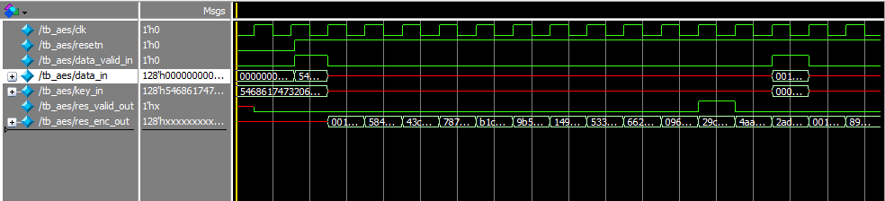

# AES RTL Implementation
A complete SystemVerilog implementation of the Advanced Encryption Standard (AES) (128 for now) algorithm for FPGA and ASIC development.

## Overview
This project provides a fully functional, synthesizable AES-128 encryption/decryption written in SystemVerilog. The implementation follows the [FIPS-197 standard](https://csrc.nist.gov/files/pubs/fips/197/final/docs/fips-197.pdf).

The algorithm consists of :
- Initial round: AddRoundKey only
- Rounds 1-9: SubBytes -> ShiftRows -> MixColumns -> AddRoundKey
- Final round: SubBytes -> ShiftRows -> AddRoundKey

Each round uses a unique round key generated by the key scheduler, ensuring identical plaintext blocks produce different intermediate states.

## Quick Start

### Prerequisites

- **ModelSim/QuestaSim**
- **Python 3.7+**
- **PyCryptodome**
```
pip install pycryptodome
```
### Running Tests

#### Generate Test Vectors
```
python generate_vectors.py
```
#### Run Test Suite

```
chmod +x run_tests.sh
./run_tests.sh
```

#### Run Individual Tests

##### Sbox/Inverse Sbox Test
```
rm work -Recurse; vsim -c -do "vlib work; vlog -sv *.sv; vsim work.tb_aes_sbox; run -all; quit"
rm work -Recurse; vsim -c -do "vlib work; vlog -sv *.sv; vsim work.tb_inv_aes_sbox; run -all; quit"
```
##### MixColumns/Inverse MixColumns test
```
rm work -Recurse; vsim -c -do "vlib work; vlog -sv *.sv; vsim work.tb_aes_mixw; run -all; quit"
rm work -Recurse; vsim -c -do "vlib work; vlog -sv *.sv; vsim work.tb_inv_aes_mixw; run -all; quit"
```

##### Key scheduling/Inverse KS test
```
rm work -Recurse; vsim -c -do "vlib work; vlog -sv *.sv; vsim work.tb_aes_key_scheduling; run -all; quit"
rm work -Recurse; vsim -c -do "vlib work; vlog -sv *.sv; vsim work.tb_inv_aes_key_scheduling; run -all; quit"
```

##### Full AES/Inverse AES test
```
rm work -Recurse; vsim -c -do "vlib work; vlog -sv *.sv; vsim work.tb_aes; run -all; quit"
rm work -Recurse; vsim -c -do "vlib work; vlog -sv *.sv; vsim work.tb_inv_aes; run -all; quit"
```
## Architecture Details

### State Machine
My implementation uses a 4-bit finite state machine that elegantly maps to the AES round structure:

| State | Value | Description |
|-------|-------|-------------|
| IDLE | 4'h0 | Waiting for input data |
| Round 1-9 | 4'h1-4'h9 | Middle rounds (full transformations) |
| FINAL | 4'hA | Final round (no MixColumns) |
| DONE | 4'hB | Output result |

```
localparam round_t IDLE = 4'h0;   // Waiting for input data
localparam round_t FINAL = 4'hA;  // Round 10 - last transformation
localparam round_t DONE = 4'hB;   // Output result and reset

// FSM Control Logic
assign fsm_en = (|fsm_q) | data_valid_in;
assign finished_v = fsm_q[3] & fsm_q[1] & fsm_q[0];
assign {unused_fsm_sum_msb, fsm_next} = finished_v ? 5'b00000 : fsm_q + 4'b0001;
assign last_iter_v = fsm_q[3] & fsm_q[1];
```

This design uses combinational logic for all transformations, achieving single-cycle execution per round.

### Data Flow

1. Initial Round: AddRoundKey only
2. Rounds 1-9: SubBytes → ShiftRows → MixColumns → AddRoundKey
3. Final Round: SubBytes → ShiftRows → AddRoundKey
4. Output: Result available with valid signal

### Core Transformations

#### SubBytes: S-box Implemenation
Rather than using lookup tables, I implemented the S-box using optimized combinational logic based on Boyar & Peralta's 2009 research. This approach reduces area and eliminates memory dependencies:

```
generate 
    for (i = 0; i < 16; i++) begin : loop_gen_sb_i				
        aes_sbox sbox(
            .data_in(data_q[(i*8)+7:(i*8)]),
            .data_out(sub_bytes[(i*8)+7:(i*8)])
        );
    end
endgenerate
```

The S-box module contains 67 internal logic terms implementing the mathematical transformation in GF(2^8), resulting in a compact design.

#### ShiftRows: Byte Permutation
ShiftRows is implemented as a pure wire remapping, making it zero-cost in hardware:

```
// First row (r = 0) is not shifted
assign shift_row[127:120] = sub_bytes[127:120];  // byte 0
assign shift_row[95:88]   = sub_bytes[95:88];    // byte 4

// Second row (r = 1) is cyclically left shifted by 1
assign shift_row[119:112] = sub_bytes[87:80];    // byte 1 <- byte 5
assign shift_row[87:80]   = sub_bytes[55:48];    // byte 5 <- byte 9
assign shift_row[55:48]   = sub_bytes[23:16];    // byte 9 <- byte 13
assign shift_row[23:16]   = sub_bytes[119:112];  // byte 13 <- byte 1
```
#### MixColumns: Galois Field Arithmetic
MixColumns performs matrix multiplication in GF(2^8). The key insight is that all operations can be implemented using XOR and a single multiplication by 2 (xtime):
```
module aes_mixw (
    input logic [31:0] w_i,
    output logic [31:0] mixw_o
);
    logic [7:0] b0, b1, b2, b3;
    logic [7:0] gm2_b0, gm2_b1, gm2_b2, gm2_b3;
    logic [7:0] gm3_b0, gm3_b1, gm3_b2, gm3_b3;
    
    // GF(2^8) multiplication by 2 (xtime)
    assign gm2_b0 = b0[7] ? ({b0[6:0], 1'b0} ^ 8'h1b) : {b0[6:0], 1'b0};
    
    // GF(2^8) multiplication by 3
    assign gm3_b0 = gm2_b0 ^ b0;
    
    // Matrix multiplication
    assign mb3 = gm2_b3 ^ gm3_b2 ^ b1 ^ b0;
    assign mb2 = b3 ^ gm2_b2 ^ gm3_b1 ^ b0;
    assign mb1 = b3 ^ b2 ^ gm2_b1 ^ gm3_b0;
    assign mb0 = gm3_b3 ^ b2 ^ b1 ^ gm2_b0;
    
    assign mixw_o = {mb3, mb2, mb1, mb0};
endmodule
```
Four parallel MixColumns units process all columns simultaneously, maintaining the single-cycle-per-round performance.

#### AddRoundKey
The simplest transformation is just XOR with the round key:
```
assign round_key_result = data_valid_in ? data_in : (last_iter_v ? shift_row : mix_columns);
assign data_next = round_key_result ^ key_current;
```
The multiplexer logic handles the different data paths for initial input, middle rounds, and final round.

#### Key Scheduler Implementation
The key scheduler generates round keys using three operations: RotWord, SubWord, and Rcon XOR:
```
module aes_key_scheduling(
    input logic [127:0] key_in,
    input logic [7:0] key_rcon_in,
    output logic [127:0] key_next_out,
    output logic [7:0] key_rcon_out
);

// RotWord: {a,b,c,d} -> {b,c,d,a}
assign temp_rotated = {w3[23:16], w3[15:8], w3[7:0], w3[31:24]};

// SubWord using S-box
aes_sbox sbox_0 (.data_in(temp_rotated[31:24]), .data_out(sbox_out_0));
aes_sbox sbox_1 (.data_in(temp_rotated[23:16]), .data_out(sbox_out_1));
aes_sbox sbox_2 (.data_in(temp_rotated[15:8]),  .data_out(sbox_out_2));
aes_sbox sbox_3 (.data_in(temp_rotated[7:0]),   .data_out(sbox_out_3));

assign temp_subbed = {sbox_out_0, sbox_out_1, sbox_out_2, sbox_out_3};
assign temp = temp_subbed ^ rcon_word;

// Generate new key words
assign w4 = w0 ^ temp;
assign w5 = w1 ^ w4;
assign w6 = w2 ^ w5;
assign w7 = w3 ^ w6;
```
The Rcon values follow a specific pattern in GF(2^8) implemented as a simple lookup function.

### Decryption
Decryption uses inverse transformations in reverse order. The key insight is that the inverse operations can reuse much of the forward encryption logic:

- InvSubBytes: Uses inverse S-box lookup table
- InvShiftRows: Right shifts instead of left shifts
- InvMixColumns: Matrix multiplication with inverse matrix
- AddRoundKey: Same operation (XOR is self-inverse)

The inverse key scheduler works backward from the final round key to generate previous round keys:

```
// Inverse key expansion: calculate previous round key
assign w_prev3 = w2 ^ w3;
assign w_prev2 = w1 ^ w2;  
assign w_prev1 = w0 ^ w1;
assign w_prev0 = w0 ^ temp;  // temp derived from w_prev3
```
## Verification and Testing
I created a Python script using PyCryptodome as a golden model to generate a small set of test vectors:
```
def write_test_vectors(test_vectors, output_dir='test_vec'):    
    for i, tv in enumerate(test_vectors):
        plaintext = tv['plaintext']
        key = tv['key']
        
        # Perform AES encryption
        cipher = AES.new(key, AES.MODE_ECB)
        ciphertext = cipher.encrypt(plaintext)
        
        # Write both binary and hex formats
        files['data_bin'].write(hex_to_binary_string(plaintext) + '\n')
        files['key_bin'].write(hex_to_binary_string(key) + '\n')
        files['res_bin'].write(hex_to_binary_string(ciphertext) + '\n')
```

### Test Suite Architecture
The verification environment includes:

1. Component-level tests: Individual S-box, MixColumns, and key scheduler verification
2. System-level tests: Full encryption/decryption with NIST test vectors
3. Corner case testing: All zeros, all ones, and custom patterns
4. Roundtrip verification: Encrypt then decrypt to verify data integrity

### Testbenches
The main testbench uses file-based verification:

```
\\ Process test vectors
while (!$feof(tb_data_in_file) && !$feof(tb_key_in_file) && !$feof(tb_res_enc_out_file)) begin
    // Read test vector lines
    if ($fgets(tb_data_in_line, tb_data_in_file) == 0) break;
    
    // Convert hex strings to logic vectors
    tb_data_in_line_vec = tb_data_in_line.atohex();
    
    // Apply inputs and wait for result
    data_valid_in = 1'b1;
    data_in = tb_data_in_line_vec;
    key_in = tb_key_in_line_vec;
    
    @(posedge clk);
    data_valid_in = 1'b0;
    
    // Wait for valid output
    while (res_valid_out !== 1'b1) @(posedge clk);
    
    // Verify result
    assert (res_enc_out === tb_res_enc_out_line_vec) else begin
        $error("AES output mismatch: Expected %032h, Got %032h", 
               tb_res_enc_out_line_vec, res_enc_out);
        $finish;
    end
end
```
### Performance
#### Timing and Throughput
- Latency: 12 clock cycles (10 encryption rounds + 2 control cycles)
- Throughput: 1.067 Gbps @ 100 MHz  
- Efficiency: 10.67 bits per clock cycle

#### Resource Utilization
The design optimizes for balanced area/performance:
- Logic elements: Moderate usage due to combinational S-box
- Memory: Zero block RAM usage (no lookup tables)
- DSP blocks: Not required
- Routing: Clean due to regular structure

## Resources
- [NIST FIPS 197 AES and its test vectors](https://nvlpubs.nist.gov/nistpubs/FIPS/NIST.FIPS.197-upd1.pdf)
- [AES Animation](https://legacy.cryptool.org/en/cto/aes-animation)
- [Galois Field Arithmetic](https://en.wikipedia.org/wiki/Finite_field_arithmetic)
- [Rijndael Block Cipher: AES](https://csrc.nist.gov/csrc/media/projects/cryptographic-standards-and-guidelines/documents/aes-development/rijndael-ammended.pdf)
- [Boyar & Peralta (2009): "A new combinational logic minimization technique with applications to cryptology"](https://eprint.iacr.org/2011/332.pdf)

⚠️ Disclaimer: This implementation is for educational and research purposes. Production cryptographic systems require additional security analysis and validation.
